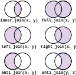

```{r klippy, echo=FALSE, include=TRUE}
klippy::klippy()
```

## Tidy data

In the data manipulation lesson, we discussed how to make your data frames "tidy" 

Tidy data is set up such that:

- Every column is a variable
- Every row is an observation 
- Every cell is a value. 


For the rest of the semester, we will be working with the City of Raleigh historic water quality data. This data was obtained using a records request with the city.

The original data that was sent over is in your data folder and is named `raleigh_wq_2008_2023.csv`

[**Exercise**](#tidy-water-quality-data): Open the data in excel or google sheets. Make a list of things you would need to do to original data set to get into the tidy format. 

## Dealing with missing data and outliers

Within datasets, there are often data where the value is unknown, or missing. These are characterized as `NA`. As you have seen when, working with `max()` or` mean()`, it is important to deal with these NA values in some way. When you try to take the maximum of a string of numbers and one value is missing, you do not know what the true maximum value is. For example:

```{r}
x <- c(1, 5, NA, 6, 3)
max(x)
```

The output here is NA, because the maximum value is unknown. It is possible that the unknown value is the highest one. To get the maximum value based on the values we do know, we must remove the NA, using na.rm. We can set the argument na.rm to TRUE.

```{r}
max(x, na.rm = TRUE)
```

You will notice NAs in the water quality dataset. For example, if we look at just one sampling date, we can see there are NAs for some of the parameters. A value for these exist, we just don't know them for whatever reason. Likely, they were not measured at this time. But you can also use NA when there are errors with collection.

```{r, message=F}
water <- read.csv("../../data/raleigh_wq_clean-units.csv")
library(dplyr)
water |>
  filter(Site == 'PHB12', Date == '2023-12-07')
```

Missing data in datasets is common. Statistical models handle them in different ways, so it is important to evaluate the statistical models individually.  You do not need to do anything to the NA values. However, it is good to know how much of the data is missing. For example, say you have 100 samples, but 20 are NA. This affects the amount of replicates you have to work with. 

Let's explore a bit in the water quality data set. Often, you don't need to go over every NA upfront, but can evaluate as you run analyzes with the data.

The `is.na()` function will tell you if values are NA. You will get a TRUE if NA, and a FALSE if not. 

For example, let's look at Salinity in the dataset. Here you get a list of true or false for every value in the Salinity_ppt column.

```{r}
is.na(water$Salinity_ppt) |> head(30)
```
You can use sum() to count all the TRUE values

```{r}
sum(is.na(water$Salinity_ppt))
```

You can use the group_by and summarize`summarize()` function to determine the amount of NAs for different variables. Here, I also use `n()` to get total number of values

```{r}
water |>
  group_by(Site)|>
  summarise(n_NA = sum(is.na(Salinity_ppt)), n = n())
```

[**Exercise**](#missing-data): On your own play around with the data to explore how much missing data is in the dataset. 

### Outliers

There are cases where you have outliers in the data set. Outliers are values that are very different from the rest of the data. Outliers can exist for valid *or* invalid reasons. For example, an outlier could represent an error in the collection of the data or the data entry. But it also could be a true value that is very different for other reasons, like environmental conditions. It is *not* good practice to remove outliers from the data set, but they should be evaluated on a case by case basis. If you determine that the outlier was due an error, you can change it to an NA or missing value, instead of removing it entirely. 

For example, if you were calculating the height of 10 people and had the following data, one is clearly due to a error. 

```{r}
height <- c(61, 69, 65, 72, 620, 67, 70, 71, 74, 68)
height
```

It certainly seems that an extra 0 was added to the end. If you can confirm this, you can change the value to the correct one. For example, you can use `recode()`.

```{r}
recode(height, `620` = 62)
```

Otherwise, you should make an NA. You can do this using na_if() in `dplyr`. In `na_if` you supply arguments for the name of the vector you are editing and the value that should be turned to NA

```{r}
na_if(height, 620)
```

You can see in the water quality data set that there is an outlier in the E_coli_MPN_100mL parameter. 

```{r}
water |>
  arrange(-E_coli_MPN_100mL) |> 
  select(Site, Date, E_coli_MPN_100mL) |>
  head() 
```

[**Exercise**](#e-coli-outlier) How could you use mutate() and na_if() to deal with E. coli outlier. 

### Filtering with regular expressions

As you can see in the last example, there are some Sites labelled as DUP. These are used for quality control. So occasionally, they ran duplicate samples to confirm that instruments were working correctly. These duplicate sites are then duplicates in the data frame, meaning some times have twice the data. We can simply remove these duplicates.

You could remove each individual dup site with filter. However, you can also use the `grepl` function to filter by a regular expression. This allows you to supply a "pattern" of numbers and letters to match and filter by. Here, we will filter by "dup"

```{r}
water |>
  filter(grepl('DUP', Site, ignore.case = T)) |>
  distinct(Site)
```

This gave all the rows with dup in the title of the site, ignoring the case. We can add in ! to *remove* all dup. 

```{r}
water |>
  filter(!grepl('DUP', Site, ignore.case = T)) |>
  distinct(Site)
```

In the previous examples, you *did not* save anything. Your file remains unchanged. To continue working with the file, you should assign it a new variable name. 

```{r}
water_edit <- water |>
    mutate(E_coli_MPN_100mL = na_if(E_coli_MPN_100mL, 155310)) |>
    filter(!grepl('DUP', Site, ignore.case = T))
```

You can also use `write.csv()` to save a csv to your computer. DO not write over file, should save as new file name. 

```{}
write.csv(water_edit, 'raleigh_wq_modified.csv')
```

## Dealing with Dates

Dates can be a complicated data format to work with in R. They are often characterized as "characters", however they do have a quantitative nature and can thus be considered as continuous. 

With the water quality data, the date is in the format yyyy-mm-dd. One thing that we can do is use the separate function to make a column for year, month, and day. With separate(), you supply the arguments for:

1. The column you are separating
2. The names of the new columns using into = . You should give the same number of names as new columns. 
3. The character that is separating the columns. 

`separate()` is in the `tidyr` package. So you will have to load it. 

**How would you use separate with the Date column?**

[**Exercise**](#separate-stream-names) In the stream codes file ("raleigh_wq_stream_codes.csv", separate lat and long into two columns. You will need to set header = F in the `read.csv()` function

```{r, echo = F, warning=FALSE}
library(tidyr)
streams <- read.csv('../../data/raleigh_wq_stream_codes.csv', header = F)
streams <- streams |>
  separate(V2, into = c('lat', 'long'), sep = ',') |>
  filter(!is.na(long))
```

### Lubridate

While the separate function allows us now to use each individual unit as a number, a better and easier way is to set the data class as a date. The package `lubridate` does this easily. Lubridate has a variety of functions based on the order of the date objects in the string, for example dmy(), myd(), ymd(). 

Our date is in the year, month, date format so we can use the function ymd() to turn the Date column into a date class. 

```{r, message=F}
library(lubridate)
water_edit<- water_edit |>
  mutate(Date = ymd(Date)) 

head(water_edit)
```

You can see the data itself didn't change, but under Date, the type of data has changed. 

You can also use other lubridate functions to extract out the date components like month(), year(), wday(). For example, you could use year() with mutate() to get a column for the year.

```{r}
water_edit |>
  mutate(year = year(Date))|>
  head()
```

[**Exercise**](#plot-with-date) This date format comes in handy when plotting. Choose 1 variable in 1 stream and plot with Date on the y axis

## Joins
The water quality data set includes many water quality metrics. However, you may want to add in other data to use with the water quality data in your analysis. 

For example, one question the City of Raleigh has is how the precipitation might affect the values collected. To answer this question, you have to "join" two data sets. 

You can do this using dplyr "join" functions. There are a few different join functions based on what rows to include from the two data sets. For example, you can keep every row from both data sets (full_join), only rows that are in both (inner_join), or all rows from one (left_join or right_join) 


When doing a join, you must give at least one column to know how to match the two data sets. 

For example, let's add a column where we add the full stream name. We will match with the stream code. 

In the exercise, you used separate to make a column for latitude and longitude in the stream. Now let's separate it further with the code and stream name. To make it easier, we will give the code the same column name as in the water quality dataset (Site)

```{r}
streams_sep <- streams |>
  separate(V1, into = c('Site', 'Stream'), sep = '—')
head(streams)
```

We want to keep all the rows in the water quality data set. So we will do a left join (with the water quality data as the "left" argument)

```{r}
left_join(water, streams_sep) |>
  head()
```
By default, the function found the column that matched both data frames. You could also specify the argument `by = "Site"` to do the same. 

Now let's say that you only wanted to include the stream name and not the x and y coordinates. You can incorporate pipes with the joins as well. Here is  also give an example of what to do when the join column names do not match. 

```{r}
streams |>
  separate(V1, into = c('Code', 'Stream'), sep = '—') |>
  select(Code, Stream) |>
  right_join(water, by = c('Code' = 'Site')) |>
  head()
```

[**Exercise**](#join-precipitation) For homework, try to join in the precipitation data for the streams in the water quality data set. Do an analysis to see if precipitation affects one of the parameters.

## Exercises

### Tidy water quality data

Open the data in excel or google sheets. Make a list of things you would need to do to original data set to get into the tidy format. 

### Missing data
Play around with the data to explore how much missing data is in the dataset. 

### E coli outlier

How could you use mutate() and na_if() to deal with E. coli outlier. 

### Separate stream names
Use separate to make a column of lat and long in the stream codes file (raleigh_wq_stream_codes.csv). Use `write.csv()` to save the file so you can use later. 

### Plot with Date
Choose 1 variable and 1 stream and plot with Date on the x axis

### Join precipitation
Join stream precipitation data into water quality data set, using the dataset 'precip_stream_sites.csv'. This data set has the precipitation for each stream site for every day from 2008 - 2023. Choose one parameter (either E_coli_MPN, TSS_mg_L, Copper_mg_L) and run an analysis to see if the amount of rainfall impacts the value of the parameter. Include all code and a paragraph of your conclusions. 

## List of new functions
- is.na
- na.if
- write.csv
- grepl
- separate
- lubridate
- join 

## Resources

- [R for Data Science](https://r4ds.hadley.nz/transform)
- R for Data Science: [outlier discussion](https://r4ds.hadley.nz/eda#unusual-values)
- more about [dplyr joins](https://www.tidyverse.org/blog/2023/01/dplyr-1-1-0-joins/)
- [Lubridate cheat sheet](https://rawgit.com/rstudio/cheatsheets/main/lubridate.pdf)

