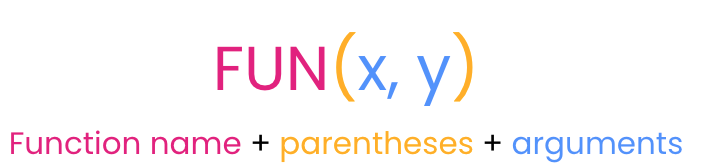
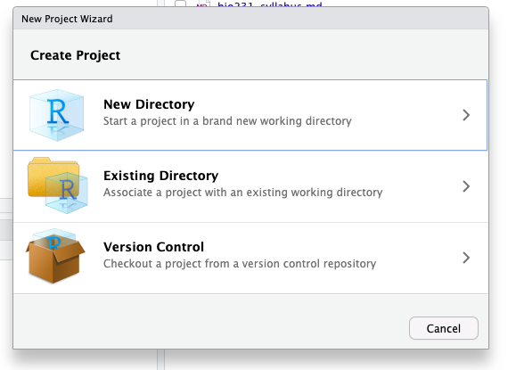
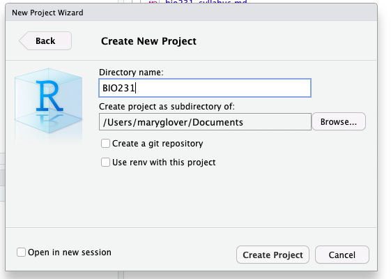

## Learning objectives

**By the end of this lesson, you should be able to:**

- Navigate Rstudio
- Run code from console notebook
- Perform mathematical operations in R
- Assign variables
- Describe different data types
- Use functions
- Import data into R

This semester, we will be using R to perform data manipulation, analysis, and visualization

## Introduction

### What is R?

R is a free, open source computing *software* used for statistical analysis and graphing. R is also a computing *language*. This means that R software interprets the R language, which is a specific set of vocabulary, formatting, and structure, to perform specific tasks. Other coding languages are Java, C++, python, etc.

### What is Rstudio?

Rstudio is an interface that runs the R software in a user friendly format. Rstudio allows the user to run R code, take notes, view graphs, and view files in one window.

We will be using Rstudio in class for computing assignments. When you open Rstudio, you should see three main panes. 

- The *console* is where the R code is run
- The *environment* shows you varables that have been created in R. You can also click to see history or code run in this pane. 
- The *viewer* has tabs to display plots, files on your computer, and help documentation.


## File management

Before we start coding, it is important to set up a folder where you will be working this semester so that everything is organized and R knows where to find your files. In Rstudio, you can set up an *R project* which is a folder on your computer. When you open the project, Rstudio will automatically go to that folder, making it easier to work with data (importing and exporting) and create coding scripts. 

You will make an R project for the class work. When you open Rstudio it will automatically open the last project. Or you can open by using File --> Open Project. 

### Tips for naming files and directories

A large part of coding is moving through directories (folders) and accessing files. 

When naming files and directories, it is important that they will be easy to work with.

- R is case sensitive! So be aware of your capitalization
- Do *not* use spaces in your names. If you would like to separrate words you can use "_" or "-"
- Pay attention to file extensions (i.e. .jpg, .pdf, .txt). You will need to use full name when working with files. 
- Folders in names are separated by "/". So for example the directory "Documents/bio_files" is a folder "bio_files" inside the folder "Documents." "Documents/bio_files/photosynthesis.pdf" Is a PDF file inside the bio_files folder. 

**Exercise**: Complete the make an R project [exercise](#make-an-r-project)

## Using R

The next few sections will go through common tasks performed in R, which are needed to complete analyses.

### Mathematical calculations

R can perform basic mathematical calculations. To compute a calculations, simply type it in the *Console*. You can do addition (+), subtraction (-), multiplication (\*), division (/), power (\^), to name a few. You can also use parentheses as usual in mathematical equations.

For example for 5 times 2:

```{r}
5 * 2
```

One your own, try some mathematical calculations in the Console.

### Using a R script

While you can run code in the console, it is a much better practice to create an R script. This allows you to save your scripts so that you know what you did in an analysis and makes your science *reproducible*. In the script, you can take notes, write code, and run code all from the same file. You can also save the file and re-run or go back and edit later.

Open up a new script by going to File --> New File --> R script. A script file will open above the console. 


All of your code should be typed in the script. To run the code from the notebook, but your cursor on the line that you want to run. Then click "Ctrl + enter" on a Windows or Linux machine or 'Cmd + enter' on a Mac.

To add notes, add a '\#' to the beginning of a line. This line will not be run in R. For example:

```{r}
# I am doing math
5 * 10
```

**Exercise** Try out some code in a script. Complete steps one and two of [exercise 2](#create-a-script).

### Functions in R

Most tasks in R will be accomplished using **functions**. Functions is code that is stored in R and will run a specific task.

Functions are run using the function name followed by the "arguments." A function can have any number of arguments.

{width="50%"}

Functions can range from very simple to very complex. Many functions exist in R without doing anything, you can "load" additional functions through "packages", or you can even make your own functions.

For example, `log` is a function that will take the natural log of the value given as an argument.

```{r}
log(1.5)
```

The `log` function can also take an addition argument which sets the base that the logarithms are computed. Two arguments are possible with `log`, x (or the value) and base. So to take the base 10 logarithm of the value 1.5, you could do the following:

```{r}
log(1.5, 10)
```

This could be written to include the names of the arguments to avoid confusion.

```{r}
log(x=1.5, base =10)
```

There are many other mathematical function such as sum, max, min, mean, median, sd (standard deviation). 

Hint: To get help with a specific function, use '?' followed by the function name

**Exercise** Try out a function in your script. Complete step three [exercise 2](#create-a-script).

### Assigning variables

In R, you can store information (numbers, tables, text, etc.) in variables. To do this, a variable is assigned a name using the characters `<-`. For example, to assign the letter a the value 1.5, type:

```{r}
a <- 1.5
```

Then, when you run `a`, you can see the value.

```{r,}
a
```

You can now treat `a` as 1.5. For example, you can take the log of `a`, which is the same as running `log(1.5)`

```{r}
log(a)
```

### Data types

So far, we have only dealt with single numbers, but R can handle numbers or text. With numbers, you can type them in regularly and R will recognize them as such. Text is put into quotations (""). You can use single(') or double (") in R. Without the quotation mark R will try to find a variable of the same name.  

For example, instead of a number, you can store text in a variable:

```{r}
b <- "hello"
```

Then when your run the varable `b`, you get the text as the output.

```{r}
b
```

There are other types of data, but numbers (*numeric*) and text (*characters*) are the two main types we will use in this class.

### Vectors

Data can be stored in different data structures including vectors, data frames, and matrices.


**Vectors** are a one dimensional way to put together data of the *same* type (i.e. all text or all characters). The most common way to create a vectors is by using the `c()` function, which concatenates, or combines, values into a vector.

Here, a vector with the numbers 5, 10, 20 are made into a vector named example.vector

```{r}
example.vector <- c(5, 10, 20)
example.vector
```

You can also perform mathematical calculations or functions with vectors. The function is performed on each entry in the vector

```{r}
example.vector / 5
```

Vectors can also store character data. 

```{r}
rainbow_colors <- c('red', 'orange', 'yellow', 'green', 'blue', 'indigo', 'violet')
rainbow_colors
```

#### Using Functions

You can also run a function with a vector. For example, the function `sum` takes the sum of all numbers. 

```{r}
sum(example.vector)
```

You can also use functions on vectors made with characters. 
For example, here I will use the function `length` to see how long the character vector `rainbow_colors` is. 

```{r}
length(rainbow_colors)
```

#### Subsetting vectors

One useful tool is using subsets to determine what is in a specific place in a vector. This is done using brackets "[]". 

In the `rainbow_colors` vector, there are 7 elements. If you want to see what is the third element, you would do the following:

```{r}
rainbow_colors[3]
```

If you want to to see what is in the fourth, fifth, and sixth place, you would use the `c()` function again to use more than one number. 

```{r}
rainbow_colors[c(4, 5, 6)]
```

Alternatively, in R you can also use `4:6` to go from *4* to *6*. The `:` symbol creates a sequence. 

```{r}
rainbow_colors[4:6]
```

### Data frames
**Data frames** are  data structures with rows and columns, like a table. Each column is essentially a vector, so must have the same data type (i.e. numbers or characters). However, a data frame can consists of columns with different data types. This is widely used for storing data because you can have a column with the treatment name (text) and then a column of the measurement (number).

A data frame might look something like this

```{r, echo=F}
treatment <- c('control', 'control', 'control', 'high N', 'high N', 'high N', 'low N', 'low N', 'low N' )
growth <- c(5, 8, 6, 1, 8, 9, 5, 2,3)
df<- data.frame(treatment, growth)
df
```

A **matrix** is similar to a data frame except that *all data* in a matrix are the same type (i.e. all characters or all numbers).

## Working with data frames

Data frames most common data structure that you will be working with. Here, we will go over some of the basics of data frames. 

### Creating a data table

For the most part, you will be importing data into R as a data frame from a csv file. However, you can make your own using R functions. 

*Remember the function 'c()' is used to concatenate or combine numbers or characters into a vector string. *

There are couple ways to create a data frame. 

First, you can use the function `data.frame()`. Using `data.frame` the arguments are what goes into the data frame *columns*. The following makes a data frame with the characters "column1" and "column2" in two different columns. This data frame has 1 row and 2 columns.

```{r}
data.frame('column1', 'column2')
```

This next data frame will have one column of characters and one column of numbers. You can also use "=" to name the column. You should also *save* the data frame assigning (`<-`) to a variable. 

```{r}
class_data <- data.frame(independent = c('low', 'med', 'high'), dependent = c(30, 22, 45))
class_data
```

You can also add additional columns or rows using the `cbind()` or `rbind()` functions respectively. Below, I'll add an additional column to the `class_data` data frame. 

```{r}
dependent2 <- c(5, 10, 15)
class_data <- cbind(class_data, dependent2)
class_data
```

Notice here that the code *rewrote* the class_data object. Be careful doing this!

You can also add row or column names or change the existing ones using `rownames` or `colnames`. Let's say that this data is based on the amount of nitrogen added to plants and I want the row names to include the exact amount (in g). I can also change the column names to be more specific. The key to this function is that you must give the same number of elements as there are rows to `rownames` and columns to `colnames`. You are *assigning* the column or row names with new data. 

```{r}
rownames(class_data) 
rownames(class_data) <- c('N5', 'N10', 'N20')
colnames(class_data) <- c('nitrogen', 'growth', 'height')
class_data
```

### Subsetting

Just like you did with vectors, you can also show specific rows and columns or *subset* data frames. This is again done with brackets. However, in data frames you specify the number row and columns. The first number in brackets is the row, the second is the column. So if you want the third row in the first column you would use [3, 1]. For example:

```{r}
class_data[3, 1]
```

Again, you can specify a range using ":"

```{r}
class_data[1, 2:3]
```

If you would like all rows or all columns, you leave the place in brackets empty. 

```{r}
class_data[2, ]
class_data[ , 1]
```

In data frames, you can also specify the column using "$" and the name of the column. 

```{r}
class_data$growth
```

### Functions on data frames

When specify just a single column in the last section, you essentially created a vector. You can also use functions on this vector. 

For example, you can use `sum` for total growth 

```{r}
sum(class_data$growth)
```

Other useful functions are `max` and `min` which show you the maximum and minimum values. 

```{r}
max(class_data$height)
```

## Exercise

### Make an R project

We will use an R project for the class work. 

1. To make an R project for the class, go to "File --> New Project" in Rstudio.
2. Click on "New Directory." This is creating a new folder on your computer for the R project. 

{width="50%"}

3. Next, you will name the project (remember your tips for naming). You can also specify where the project will be on your computer. For example, I have named by project "BIO231" and put it in my Documents folder.

{width="50%"}

### Create a script

1. Open up a new R script and try running some code. 
2. Save the script. This should go in the folder you just created
3. run the `list.files()` function. This shows you the files that in the computer folder that you are working in. *You should see the script you made in the previous step.* If not, something has gone wrong with your script. Double check where it is saved and that you have your R project open. 

### Yahtzee exercise

In this exercise you will practice the skills that you just learned: creating variables, working with data frames, mathematical operations, and functions. **Your code should be all run in an R script and submitted to Moodle when your are done.**

1. Play a game of yahtzee!
2. Create a data frame with the scores for yourself and your teammates. The data structure should have row and column names for player names and the score category. 
1. Calculate the scores using R for the teammates. There are many ways to do this. Just find one that works for you. You can create new vectors or data frames to do this.
2. Determine the winner! Use a function here. 

### Stretch assignment

1. Add your csv file of the data you collected in the first class to your R project folder. 
1. Try running the `read.csv` function to add import the data into R. The function takes the name of the files in quotes as it's argument. 

## List of functions used today

- `log`
- `c`
- `sum`
- `length`
- `data.frame`
- `rbind` and `cbind`
- `rownames` and `colnames`
- `sum`
- `max` and `min`

## Resources

- [R for Data Science](https://r4ds.hadley.nz/workflow-basics)
- [Data Science in R: A Gentle Introduction](https://bookdown.org/jgscott/DSGI/getting-started-in-r.html)
- [Rstudio projects](https://support.posit.co/hc/en-us/articles/200526207-Using-RStudio-Projects)


