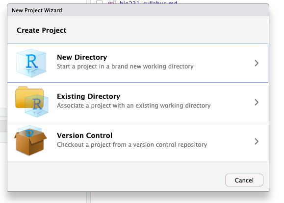

## 1. Make an R project for class

1. To make an R project for the class, go to "File --> New Project" in Rstudio.
2. Click on "New Directory." This is creating a new folder on your computer for the R project. 
{width="50%"}
3. Next, you will name the project (remember your tips for naming). You can also specify where the project will be on your computer. For example, I have named by project "BIO231" and put it in my Documents folder.
{width="50%"}

### Create a script and run code

