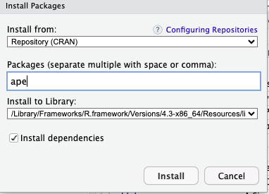
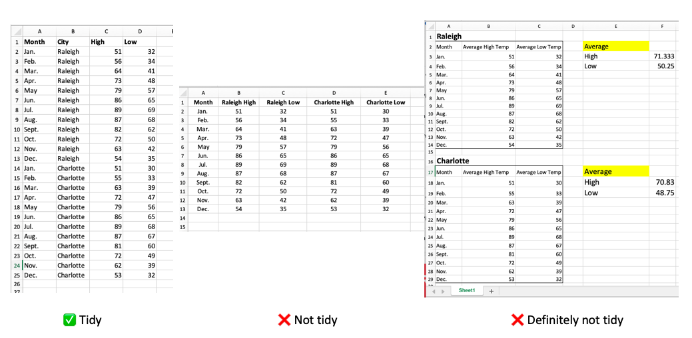

```{r klippy, echo=FALSE, include=TRUE}
klippy::klippy()
```

## R packages

So far, we have worked with functions that are loaded into R or base R functions. However, there is a world of other functions out there. You can create your own functions or use ones that others have made. An *R package* is a group of functions that can be loaded and used in R. Again, any one can make an R package, but R hosts a wide variety of functions that go through certain checks. These packages can be installed and loaded into your own R space for you to use. Most packages are a group of functions for a specific use, for example, DNA sequence analysis, diversity analyses , reading maps, etc. 

We are going to use the `dplyr` package to orgaize and manipulate data in this lesson. 

There are two ways to install a package. 

One, you can go to the packages tab in the lower right hand side of Rstudio, where your files are. Then, click install and find the package your want to install. Keep the checkmark checked for "Install dependencies." Some packages use or *depend* on functions from other packages. This will install all additional packages you need. 



This will run the code `install.packages()`. The second way is to simply run the code `install.packages()` in the console, with the name of the package

For example, if I want the `ape` package for phylogenetic analyses , I would run:

```
install.packages("ape")
```

Now, whenever I want to use functions from this package they are installed in by R library. **You only ever have to install a package once.**

Once, you have installed a package, it is there on your computer. But R doesn't "load" packages unless you tell it to. You can do this by using the `library()` function.

```
library(ape)
```

Now you can use the functions in `ape.` **Every time you open R, you do have to load the packages you want to use**

[Exercise](): Install the `dplyr` package

## What is tidy data

How data are organized in a data table is an important part of analyzing data. Keeping your data organized in a consistent and standard way will help you explore the data and use functions in R that expect data to be in a specific format. 

We will be working with "*tidy*" data. Tidy data is set up such that:
- Every column is a variable
- Every row is an observation 
- Every cell is a value. 


For example:



**Question**: Look back at your data from the first day of class. Is the data tidy?

## Using dplyr

We are going to use package `dplyr` for managing and manipulating data. To outline how to handle data with `dplyr`, we will use an example of climate data from Raleigh. This data is from the PRISM Climate Group [^1] is a part of Oregon State University and creates datasets using weather stations across the United States. The data sets include total precipitation, maximum temperature, minimum temperature, mean temperature, dew point temperature, vapor pressure deficit, and measurements of global shortwave solar radiation.

The data we are working with is for Raleigh, NC and includes minimum temperature, maximum temperature, mean temperature and precipitation for each month from 

First, we will import that data. You data "path" will depend on where you have your data on your computer. 

```{r}
climate <- read.csv("data/raleigh_prism_climate.csv")
head(climate)
```

### Pipes
As you can see, when you load the data, it is too large to show the entire data set in the R console, so the function `head` can be useful to show just the first 10 rows. One very useful tool in R which is utilized well in `dplyr` is the use of "pipes". Pipes allow you to "pipe" data into a function. This is very helpful when running many functions on a dataset. 

The pipe syntax is `|>`. You may also see `%>%` which is an older version. The pipe takes the output of the previous code and uses it as the first argument in the next function. In `dplyr`, as with many functions, the first argument is the data. 

For example, 

```{r}
climate |> head()
```

A much easier way to read the pipe is by putting functions on different lines. 

```{r}
climate |>
  head()
```

### Filter
To explore the data a bit, we can use `dplyr` functions `filter` and `select` to view only certain rows or columns. 

The `filter` function takes arguments for data and the criteria for filtering the data based on a specific column. For example, you could "filter" the data to show only rows where the year is 2023 in the climate data with the argument `year == 2023`. Here, because the year is a number you do not need quotations. If you are sorting by a character, you would need quotations marks (ex. city == "Raleigh"). 

```{r, warning=FALSE}
library(dplyr)
filter(climate, year == 2023)
```

To use the pipe, you could also do the following

```{r}
climate |>
  filter(year == 2023)
```

*Important syntax*

- == : equals
- \> : greater than
- < : less than
- != : not equal to 
- \>= : greater than or equal to 
- <= : less than or equal to 
- | : or
- %in% : matches contents of a vector

You can also filter by multiple criteria. Let's say you want only January of months before 2020. 

```{r}
climate |>
  filter(year < 2020, month == 1) 
```

You can also use the "|" sign for "or".

```{r}
climate |>
  filter(year == 2023 | year == 1985)
```

Lastly, let's say you only want the odd years in the 1990s. You could use `%in%` which will match any "in" a given vector. Remember the `c()` can make a vector.

```{r}
climate |>
  filter(year %in% c(1991, 1993, 1995, 1997, 1999 ))
```

**NOTE**: Notice in each of the previous examples your data frame `climate` remains unchanged. You have just been viewing the filtered data. If you want to save the filtered data you would have to assign it to a new variable. 

```{r}
climate2023 <- climate |>
  filter(year == 2023)

climate2023
```

### Select

`select()` is very similar to filter except it works on columns. 

Let's say you only want to look at the precipitation column and not the temperature ones. 

```{r}
climate |>
  select(year, month, precip) |>
  head()
```

You also can use the minus sign (-) to remove a column. 

```{r}
climate |>
  select(-precip) |>
  head()

```

Another useful tip is that you can even rename columns by using the equal sign with a new name.  

```{r}
climate |>
  select(year, month, precipitation = precip ) |>
  head()

```

Lastly, you can also chain the filter and select functions again using the pipe. Here, we will look only at maximum temperature for January

```{r}
climate |>
  filter(month == 1) |>
  select(year, tmax)
```


### Additional functions

Here are some other functions that can be useful when exploring the data in different columns. For each of these functions, you must specify the *column* you want to work with.


- `distinct()`: show only the unique value
- `nrows()`: the number of rows
- `arrange()` : sort the data by a specific column

You can also use other base r functions that we have used before. For example,

- `max()`
- `min()`
- `mean()`
- `median()`

[**Exercise**](#exploring-temperature-data): Play around with the temperature data. 

## Summarizing data

### Mutate

In dplyr, you can make new columns based on existing columns using the `mutate()` function. The `mutate()` function expects the format new_column = how to modify. This can be very useful for determining rates, proportions, etc. 

For example, you could get the difference in maximum temperature and minimum temperate by doing the following:

```{r}
climate |>
  mutate(temp_difference = tmax - tmin) |>
  arrange(temp_difference) |>
  head()
```

[**Exercise**](#using-mutate): Calculate tmean using `mutate()`

### Group_by and summarize

So far, we have only been summarizing on specific columns, but often we are interested in summaries based on different groups. We can do this utilizing both the `group_by()` and `summarize()` functions. `group_by()` puts the data frame in "groups" based on a column or columns. This is down "behind the scenes" and doesn't change the data output. But, when your run other functions, like `mutate()` or `summarize()` the groups are honored. 

`summarize()` allows you to make new columns based on a summary functions -- like the mean, median, or count. `summarize()` uses a similar format to `mutate`, new_column = function. 

For example, if I wanted to get the average (`mean()`) of mean temperature (tmean) for the different months, you could do the following:

```{r}
climate |>
  group_by(year) |>
  summarize(average_temp = mean(tmean)) |>
  head()
```

You can also make multiple summaries at once by adding into the `summarize()` function. Here, we can add in the standard deviation (`sd()`) and average and standard deviation for precipitation. Let's also add in a filter for only years in the 90's.

```{r}
climate |>
  filter(year %in% 1990:1999) |>
  group_by(year) |>
  summarize(average_temp = mean(tmean), sd_temp = sd(tmean), average_precip = mean(precip), sd_precip = sd(precip))
```

[**Exercise**](#summarizing-data): Which year had the highest *total* precipitation in Raleigh?

## Editting data frames

So far, you have been working with already "clean" tidy data. There are no mistakes in the data, including typos and the data is already in a tidy format. This is not always the case, either due to mistakes in entering your own data or the format of open source data. There are many functions in `dplyr` to edit data frames, including some that will change to format of rows and columns to make them in tidy format. 

We will not go into functions to edit the structure of the data frame but there are a few usefull functions to edit the cells or columns in your data frame. 

### Rename

You can use the `rename()` function to change the names of the columns. We did this already in `select()` but you can also use rename if you don't want to affect the output of columns. 

For example, in the climate data I could change the mean temperature column name with the same format to `select()`, new_name = old_name.

```{r}
climate |>
  rename(avg_temperature = tmean) |>
  head()
```

### Recode
A more complicated, but common, edit is to change the contents of a cell. This is helpful for editting typos or making varaiables consistent. 

For example, let's say that I recorded the precipitation and average temperature in Raleigh every month, but in some month's I recorded the city as "Raleigh" and some as "Raleigh, NC". Look what happens when you try to summarize the data. 

```{r, include = F}
raleigh_example <- climate |> 
  filter(year == 2023) |>
  select(Temperature = tmean, Precipitation = precip)

City <- data.frame(City=c(rep("Raleigh, NC", 6), rep("Raleigh", 6)))

raleigh_example<- bind_cols(City, raleigh_example)
```

```{r}
raleigh_example

raleigh_example |>
  group_by(City) |>
  summarize(Temp = mean(Temperature), Precip = mean(Precipitation))
```

I can combine the function `mutate()` which modifies a column and `recode()` which replaces text to make the city in the same format. `recode` expects arguments for a specific column and old_text = "new_text".

```{r}
recode(raleigh_example$City, Raleigh = "Raleigh, NC")
```

We can use mutate to modify and resave the column City with the "recoded" data. We will save this change to the data frame.

```{r}
recode_raleigh <- raleigh_example |>
  mutate(City = recode(City, Raleigh = "Raleigh, NC"))
```

Now see how this changes the summary. 

```{r}
recode_raleigh |>
  group_by(City) |>
  summarize(Temp = mean(Temperature), Precip = mean(Precipitation))
```

## Exercise

### Install dplyr

1. Install the dplyr package either from the console or using the buttons on the packages sidebar. 

### Exploring temperature data
**Complete the rest of the exercises in an R script.** Use comments to separate questions and describe what your code is doing. When you complete the exercises, submit the R script (.R file) in Moodle. 

What are you interested to know about the climate in Raleigh?  Use some of the additional functions listed in using dplyr section to explore the Raleigh temperature data. 

### Using mutate
In the climate data the mean temperature (tmean) is calculated by the Prism data group as the average of the minimum and maximum temperature. Use `mutate()` to calculate this variable and compare to the column calculated by Prism. 

### Summarizing data
Create R code to calculate which year had the highest *total* precipitation in Raleigh.

### Water quality data analysis
In this exercise, you will explore historic water quality data from the City of Raleigh. The data is collected from 2008 - 20223 and includes 19 different water quality variables, including water temperature, *E. coli* bacteria, and dissolved oxygen for 18 different stream sites. 

In this exercise, you will need to:

1. Import the data into your workspace. The data is stored in the class data google drive folder as "raleigh_wq_clean.csv"
1. Explore the data a bit using functions you learned today to see what is found in the data frame. 
1. Pick a couple of variables or columns to explore. Describe the factors that you chose and how they impact water quality. Do a little research here. 
1. Ask questions and create summarizes using functions `group_by`, `summarize`, etc. 
1. As you are writing code and exploring the data, make sure you are using comments in your script (using "#") to describe what each step of your code is doing. 
1. Write up a paragraph describing what you learned from the water quality data. You can do this also in the script. 

## List of new functions
- `filter()`
- `select()`
- `distinct()`
- `nrows()`
- `arrange()`
- `mutate()`
- `group_by()`
- `summarize()`
- `sd()`
- `rename()`
- `recode()`

*You can always use the "?" before a function to pull up the help page of a function, which also has examples.* For example `?mutate`

## Resources

There are loads of resources out there for dplyr, including simply googling what you want to do. Here are a few: 

- [R for Data Science book](https://r4ds.hadley.nz/). See data transformation and data tidying sections
- [Stat 454 Intro to dplyr](https://stat545.com/dplyr-intro.html)
- [Data school dplyr tutorial](https://www.dataschool.io/dplyr-tutorial-for-faster-data-manipulation-in-r/)

[^1]: PRISM Climate Group, Oregon State University, <https://prism.oregonstate.edu>, accessed 17 Jan 2024.