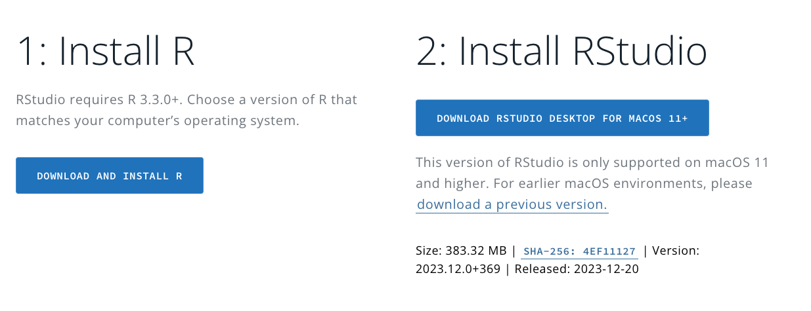
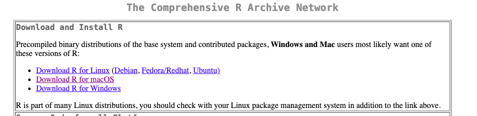
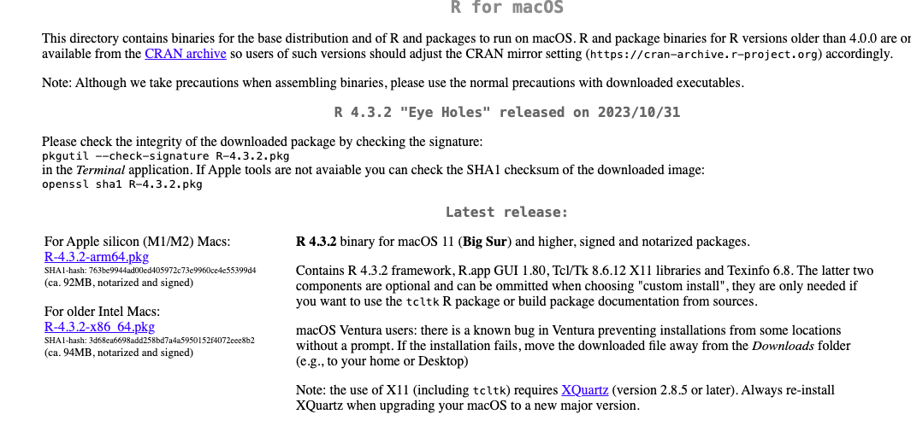
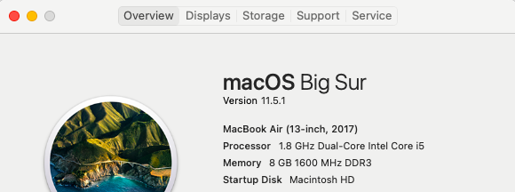
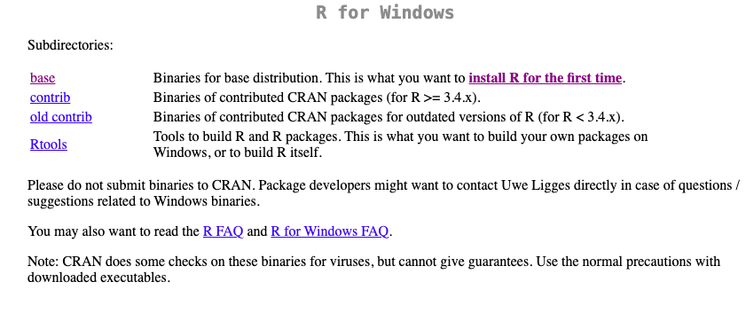
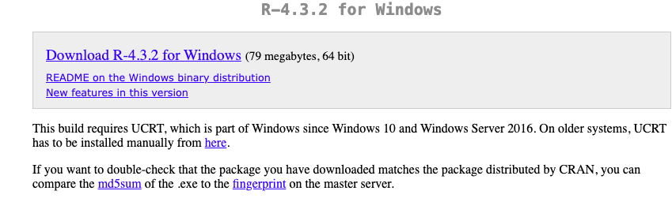

In this class, we will be analyzing data and creating visualizations using R and Rstudio. You will need to download **both** R and Rstudio. R is the programming language and Rstudio is the interface that will run R. 

To install, use the Rstudio download page [here](https://posit.co/download/rstudio-desktop/). You should see this:



## Step 1: Install R

1. First, you will install R. Click *Download and Install R*.  

2. Click on the correct link for your computer (i.e. Windows or MacOS)

### For Mac

1.  If you have a Mac, you will download either the package for M1/M2 or Intel processors.  Click on the one the is correct for your computer.  <br><br> To find out what type of processor you have, you can click the apple in the top left hand corner of your computer and *about my mac*. For example, under processor, I have a "1.8 Ghz Dual-Core Intel Core i5):, so I downloaded the Intel link. 

2. Follow the instructions on your computer for installation. 

### For Windows

1. If you a Windows operating system, you will click *Install R for the first time*
 
2. Click the download button: "Download R-4.3.2 for Windows"
 
3. Follow the instructions on your computer for installation. 

## Step 2: Install Rstudio

1. Once R has finished installing, go back to [the Rstudio website](https://posit.co/download/rstudio-desktop/). 

2. Click **Download Rstudio for desktop** and follow instructions on your computer. 

## Step 3: Test installation

1. Once you have finished downloading both R and Rstudio, **open Rstudio on your computer**. It should look like this:
 

2. In the bottom-left, you should see the *console*. Click into it. 
3. Type "1 + 1". You should see the following:

```{r}
1 + 1
```

If you do, success! If not, see Dr. Glover and send any error messages.

